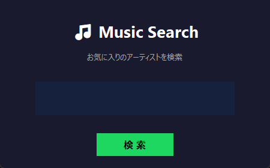
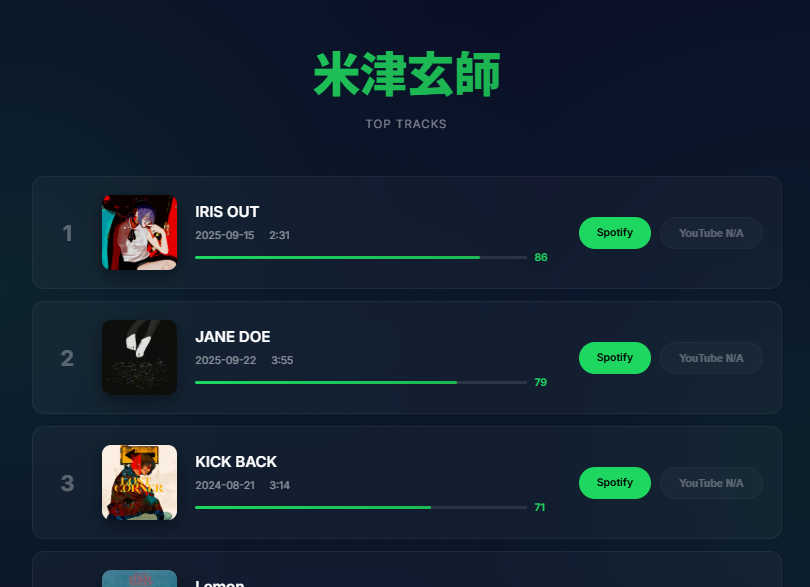
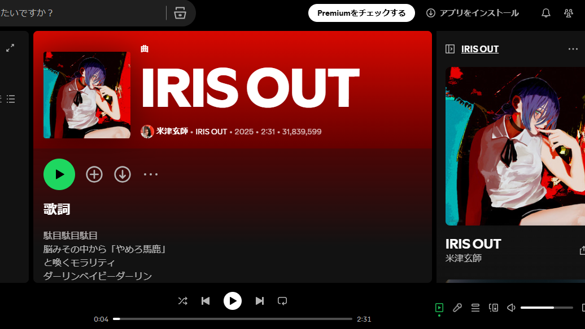

# 🎵 Music Search Web

Spotify APIとYouTube Data APIを使用して、アーティストのトップトラックを検索し、視聴可能なWebページを生成するツールです。

## 📸 スクリーンショット

### アーティスト検索画面


### トップトラック一覧


### Spotify プレーヤー


## ✨ 機能

- **アーティスト検索**: Spotify APIでアーティストを検索
- **トップトラック取得**: アーティストの人気トップ10曲を取得
- **YouTube連携**: 各楽曲のYouTube動画を自動検索
- **モダンなWeb UI**: Spotify風のスタイリッシュなHTMLページを生成
- **視聴機能**:
  - **Spotifyボタン**: 楽曲ページを新しいタブで開く
  - **YouTubeボタン**: 埋め込みプレーヤーで動画を視聴

## 🎨 デザイン特徴

- **ダークテーマ**: Spotify風の洗練された配色
- **グラスモーフィズム**: 半透明のカードデザイン
- **スムーズアニメーション**: フェードイン・ホバーエフェクト
- **レスポンシブ**: 様々な画面サイズに対応
- **Inter フォント**: モダンなタイポグラフィ

## 📋 必要要件

- Python 3.7+
- Anaconda (推奨)
- 以下のPythonライブラリ:
  ```
  spotipy
  google-api-python-client
  tkinter (通常Pythonに標準搭載)
  ```

## 🔑 API設定

### 1. Spotify API
1. [Spotify Developer Dashboard](https://developer.spotify.com/dashboard)でアプリを作成
2. Client IDとClient Secretを取得

### 2. YouTube Data API
1. [Google Cloud Console](https://console.cloud.google.com/)でプロジェクトを作成
2. YouTube Data API v3を有効化
3. APIキーを取得

### 3. 設定ファイルの作成
`config.py`ファイルを作成し、以下の内容を記述:
```python
SPOTIFY_CLIENT_ID = "your_spotify_client_id"
SPOTIFY_CLIENT_SECRET = "your_spotify_client_secret"
YOUTUBE_API_KEY = "your_youtube_api_key"
```

## 🚀 使い方

### 起動方法

1. `run_web_version.bat`をダブルクリック
2. アーティスト名入力ウィンドウが表示されます
3. アーティスト名を入力して「Search」ボタンをクリック
4. HTMLファイルが生成され、ブラウザで自動的に開きます

### 生成されるファイル

```
<アーティスト名>_tracks.html
```

例: `ado_tracks.html`, `YOASOBI_tracks.html`

## 📁 ファイル構成

```
web_version/
├── music_search_web.py   # メインプログラム
├── config.py             # API設定ファイル
├── run_web_version.bat   # 起動スクリプト
└── README.md             # このファイル
```

## 💡 使用例

### アーティスト検索
- 日本語: `ado`, `YOASOBI`, `米津玄師`
- 英語: `Ed Sheeran`, `Taylor Swift`, `BTS`

### HTMLページの使い方

1. **Spotifyボタン**: クリックするとSpotifyアプリ/Webプレーヤーで楽曲が開きます
2. **YouTubeボタン**: クリックすると埋め込みプレーヤーが表示され、その場で視聴できます

## ⚠️ 注意事項

### YouTube API クォータ制限
- YouTube Data APIには1日あたりのクォータ制限があります
- クォータ超過時はYouTubeリンクが取得できません
- Spotifyリンクは常に取得可能です

### 楽曲の視聴
- Spotifyでの視聴には無料/有料アカウントが必要です
- 一部の楽曲はYouTube動画が見つからない場合があります

## 🛠️ トラブルシューティング

### ボタンが反応しない
- ブラウザのキャッシュをクリアしてページを再読み込み
- 最新のHTMLファイルを開いているか確認

### YouTube APIエラー
```
quotaExceeded
```
- 翌日まで待つ、または別のYouTube APIキーを使用

### Spotify APIエラー
- APIキーが正しく設定されているか確認
- インターネット接続を確認

## 📝 技術スタック

- **バックエンド**: Python 3
- **API**: Spotify Web API, YouTube Data API v3
- **フロントエンド**: HTML5, CSS3, JavaScript
- **UI**: Tkinter


